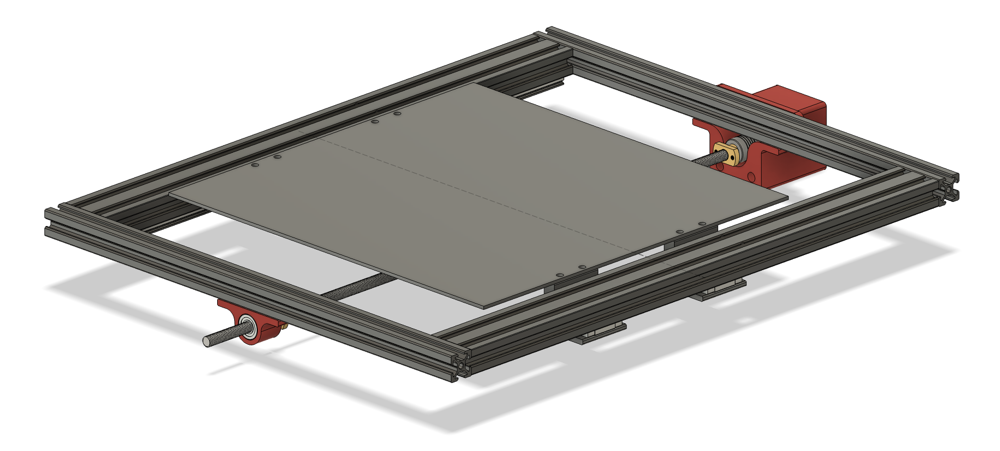
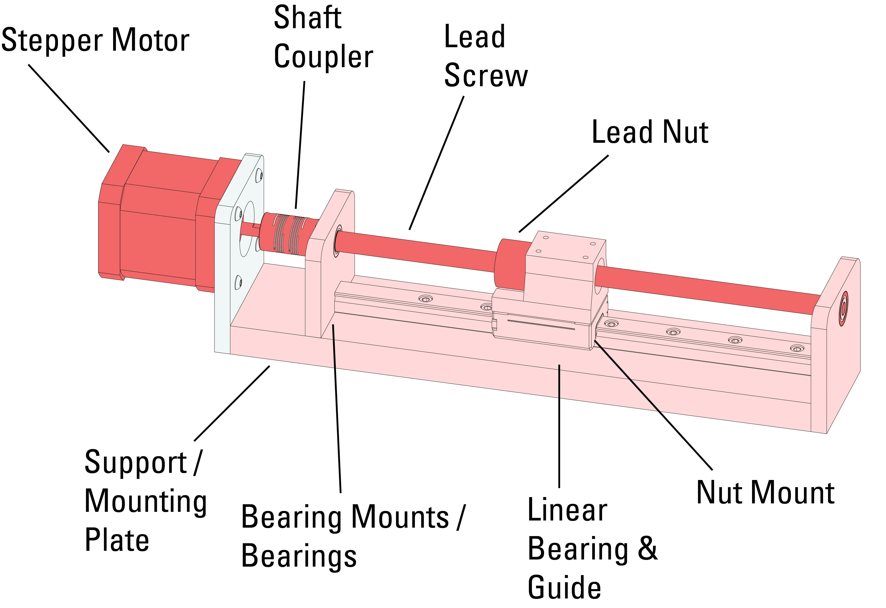

# Millie - A Small CNC Mill
*##### WORK IN PROGRESS #####*

---

I found an old Creality CR-10 by a trash can and I decided to spin off a new project out of it. I want to build a small CNC mill to add some subtractive manufacturing to my tool box. I'm not aiming for a super sturdy metal mill, but definitely a solid machine that can handle some wood and plastic with a smooth finish or mill PCB's with decent resolution.

I will be updating this page with my progress as I go.

<h2 align="center">Y-axis Mechanical Design | <em>2026-04-23</em></h2>

I am now working on the mechanical design, currently focusing on the Y-axis of the gantry. I decided to go with a moving bed design, as my end effector will probably be heavier than the parts it will cut.

The bed will be mounted on two MGN12 linear rails, each with 2 carriage blocks. I will use 3D printed parts to connect the bed to the carriages and I hope it won't be a point of failure as plastic parts might introduce some unwanted play. 

Additionally, the bed will be mounted to a lead screw carriage that will be driven by a stepper motor. The movement overall might be a little slow compared to belt driven designs, but from rigidity perspective it seems to be a good compromise.

I already printed and assembled the motor and lead screw and will be ordering the linear rails soon. The next step will be

So far, the design is looking like this:

<h2 align="center">Initial Thoughts | <em>2026-04-17</em></h2>

- The CR-10 gave me a good starting point with some useful parts - mostly the aluminum frame, lead screws, steppers, and many types of bearings.

- My style of design is a bit different and I struggle to follow the many different types of screws and nuts they use there, but I'm sure I can find a way to make it work.

- The steppers might be a bit too small for the job, but I'll start with them and will try to make the design flexible enough to fit bigger steppers if needed.

- I plan on using the lead screws for the Y axis - something of that sort: 

- there's no need for a super long Z axis like in the CR-10, so i think I'll go for a shorter rack and pinion setup close to the spindle that will allow a ~10 cm of Z axis travel. 

- The spindle design will probably be the most challenging as I have never designed anything like that, and only worked with a couple of mills so far. I will aim for a relatively off-the-shelf solution that will fit my needs, and maybe will improve it as I go. 

## Next Steps - Hardware

- [ ] Gantry design
    - [ ] Y axis
    - [ ] X axis
    - [ ] Assembly
- [ ] Spindle design
    - [ ] Z axis mounting plate
    - [ ] Motor selection 

## Next Steps - Electronics

I will probably be using Jake Read's suit for motion controllers. I used it for my plotting machine and it worked great. I really hope I won't need to get into annoying power / drivers / heat considerations.

- [ ] Motion controller PCB's
- [ ] Firmware
- [ ] Power supply

## Next Steps - Software

It feels pretty far away but for generating G-code I will probably use an off-the-shelf solution like Fusion 360's CAM or Fusion Electronics design for PCB's. I'll probably need to build some G-Code parser to translate it to machine instructions but I'm not too worried about that.

### Good luck!